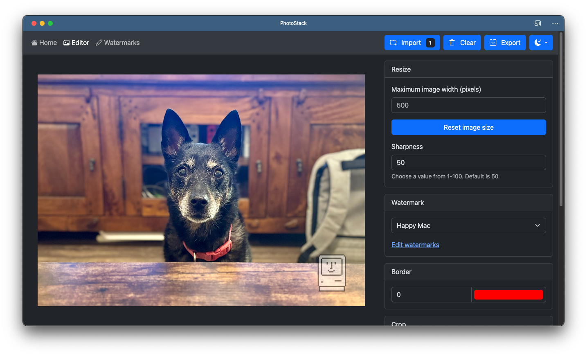

# PhotoStack

PhotoStack is a free and open-source batch photo editor that runs in web browsers, complete with offline support. It can crop, resize, and convert many images at once. You can also create and save watermarks and apply them to images.

PhotoStack uses components from [Bootstrap](https://getbootstrap.com), [FileSaver.js](https://github.com/eligrey/FileSaver.js/), [JSZip](https://stuk.github.io/jszip/), [Modernizr](https://modernizr.com/), and [Pica](https://github.com/nodeca/pica). The icon was designed by [Mason Conrad](https://twitter.com/MasNConrad).

**[Open PhotoStack in your browser](https://photostack.app)**

